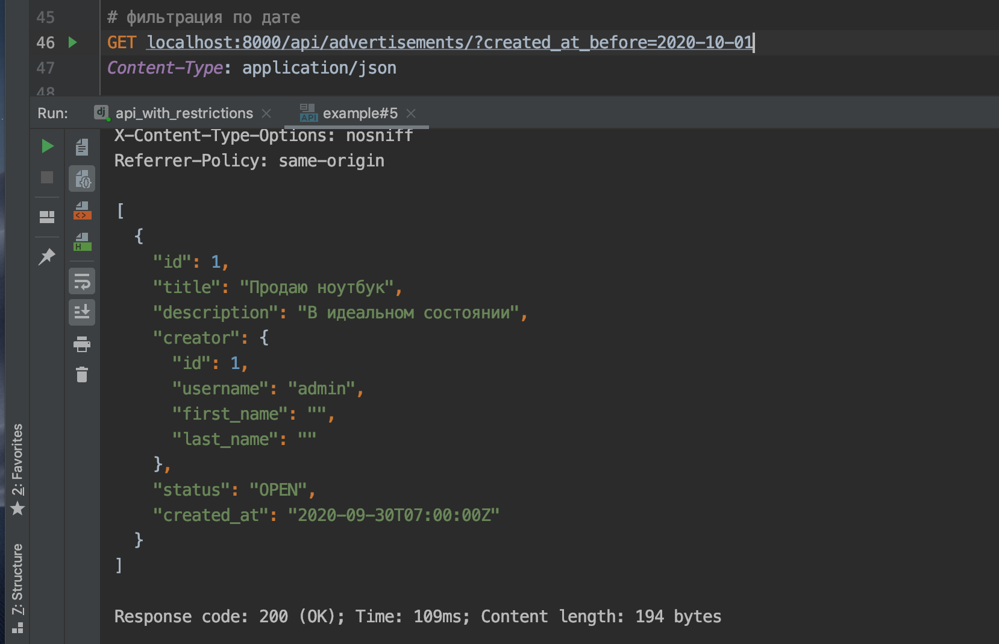
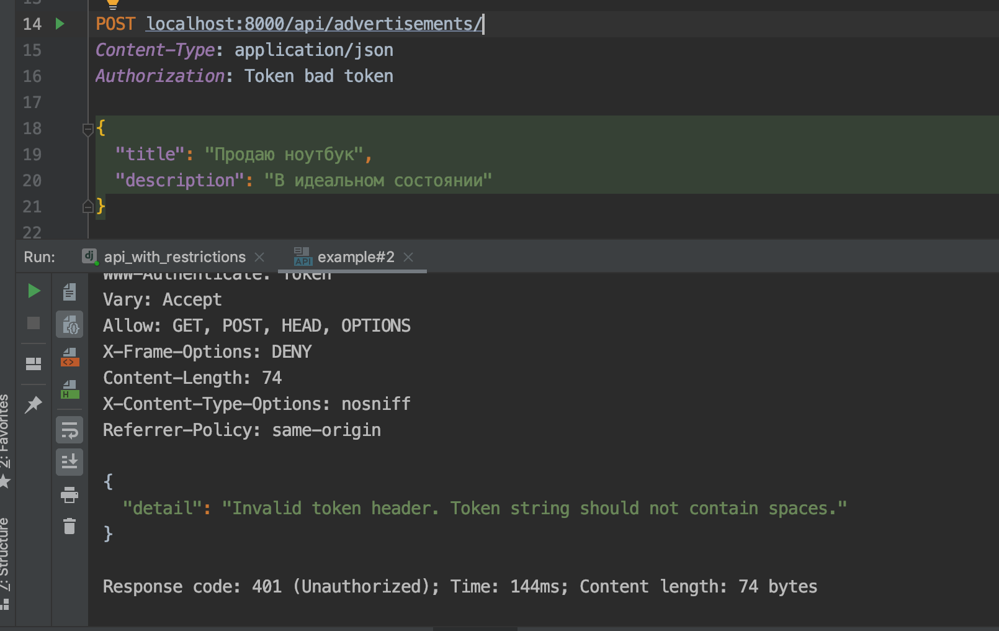

# Backend для приложения с объявлениями

## Описание

Необходимо реализовать бэкенд для мобильного приложения с объявлениями. Объявления можно создавать и просматривать. Есть возможность фильтровать объявления по дате и статусу.

Создавать могут только авторизованные пользователи. Для просмотра объявлений авторизация не нужна.

У объявления есть статусы: `OPEN`, `CLOSED`. Необходимо валидировать, что у пользователя не больше 10 открытых объявлений.

Обновлять и удалять объявление может только его автор.

Чтобы боты и злоумышленники не нагружали нашу систему, добавьте лимиты на запросы:

- для неавторизованных пользователей: 10 запросов в минуту;
- для авторизованных пользователей: 20 запросов в минуту.

## Реализация

- Используйте `DateFromToRangeFilter` для фильтрации по дате https://django-filter.readthedocs.io/en/stable/ref/filters.html#datefromtorangefilter.

Пример работы:


- В настройках подключено приложение `rest_framework.authtoken` и сконфигурирован `DEFAULT_AUTHENTICATION_CLASSES`. Для того, чтобы завести токен для пользователя, проделайте следующие шаги:

  - создайте пользователя через админку,
  - также через админку заведите ему токен,
  - этот токен используйте в запросах, передавая его в заголовках.

- Так как интерфейс BrowserableAPI в DRF не позволяет передавать заголовки с токеном, используйте Postman или HTTP-клиент VSCode.

Примеры:

Успешный запрос:


Неправильный токен:


- Для переопределения доступов для отдельных методов `ViewSet` используется метод `get_permissions`. Он добавлен в заготовку, следует с ним ознакомиться и посмотреть с помощью breakpoint'ов в какой момент DRF его вызывает.

- Валидацию удаления чужого объявления следует делать:

  - либо внутри метода `destroy` https://www.django-rest-framework.org/api-guide/viewsets/#viewset-actions — это чуть проще;
  - либо определяя дополнительный класс-наследник `BasePermission`, дополнительно добавляя его в список `get_permissions` https://www.django-rest-framework.org/api-guide/permissions/#examples — это правильнее, и этот класс можно переиспользовать для других методов.

    Любой вариант допустим в рамках этого задания.

- С примерами запросов к API вы можете ознакомиться в [файле requests-examples.http](./requests-examples.http).

# Важно

Приложение называется `advertisements`, такие слова являются триггерами для блокировщиков рекламы (например, uBlock Origin). Рекомендуется отключить блокировщик, если вы им пользуетесь, либо переименовать приложение.

## Подсказки

1. В места, где нужно добавлять код, включены `TODO`-комментарии.

2. Ознакомьтесь целиком со структурой проекта. Разберите, как работает код в заготовке, например, проставляется поле создателя объявления таким образом, чтобы злоумышленник не мог создавать объявления от чужого лица.

3. Используйте возможность указывать `fields` в `Meta` внутри `FilterSet` класса, чтобы не задавать фильтры, которые могут сгенерироваться автоматически.

4. Админка Джанго по умолчанию даст возможность создания и редактирования пользователей и токенов. Этим удобно пользоваться для локального создания сущностей.

## Дополнительные задания (не обязательные к выполнению)

### Права для админов

- Реализуйте функциональность для админов. Админы могут менять и удалять любые объявления.

### Избранные объявления

- Добавить возможность добавлять объявления в избранное. Автор объявления не может добавить своё объявление в избранное. Должна быть возможность фильтрации по избранным объявлениям. Например, пользователь хочет посмотреть все объявления, которые он добавил в избранное.

- Для того, чтобы добавить дополнительный метод с урлом во ViewSet, вам может пригодиться декоратор `action` из `DRF`.

### Добавить статус `DRAFT`

- Добавьте статус `DRAFT` — черновик. Пока объявление в черновике, оно показывается только автору объявления, другим пользователям оно недоступно.

## Документация по проекту

Для запуска проекта необходимо

Установить зависимости:

```bash
pip install -r requirements.txt
```

Вам необходимо будет создать базу в postgres и прогнать миграции:

```base
manage.py migrate
```

Выполнить команду:

```bash
python manage.py runserver
```
